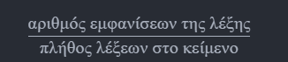

# Επαναληπτικό project

## Εκφώνηση

### Διαβάστε προσεκτικά και στείλτε μου για τυχών απορίες ή αν κολλήσατε σε κάποιο σημείο

Στο συγκεκριμένο πρόγραμμα θα θέλουμε να ψάξουμε την συχνότητα λέξεων μέσα σε ένα κείμενο που βρίσκεται σε ένα αρχείο κειμένου (.txt).

* Στο συγκεκριμένο πρόγραμμα καλείστε να διαβάσετε τα περιεχόμενα του αρχείου input.txt χρησιμοποιώντας τις οδηγίες από το παράθεμα 1 και τις επιπλέον πηγές που θα σας παραθέσω, προσέχοντας να κλείσετε το αρχείο που ανοίξατε μόλις τελειώσετε την ανάγνωση.
* Τα περιεχόμενα τύπου string θα πρέπει να τα χωρίσετε με κενά(με την χρήση μιας συγκεκριμένης μεθόδου που θα σας δώσω παρακάτω η οποία τα αφαιρεί και επιστρέφει τα ενδιάμεσα στοιχεία σε μια λίστα) και να μετρήσετε τις εμφανίσεις των λέξεων, τις οποία θα πρέπει να τοποθετήσετε σε ένα λεξικό.
* Έχοντας τελειώσει με την ανάγνωση των στοιχείων και την δημιουργία του λεξικού θα γράψετε ένα μενού που θα σας δίνει τις ακόλουθες επιλογές:
  1. στην επιλογή 1 να επιστρέφει την λέξη με τις περισσότερες εμφανίσεις καθώς και το ποσοστό εμφανίσεων της στο κείμενο:

    

  2. στην επιλογή 2 να επιστρέφει όλες τις λέξεις με την χαμηλότερη εμφάνιση.
  3. στην επιλογή 3 να διαβάζει μια λέξη του κειμένου από το πληκτρολόγιο και να επιστρέφεται το ποσοστό εμφάνισης της λέξης
  4. να εμφανίζεται ένα λάθος μήνυμα σε κάθε άλλη επιλογή(καθώς και αν ζητήσουμε μια λέξη που δεν υπάρχει).

Παρατήρηση για την υλοποίηση της 3. καλείστε να φτιάξετε μια συνάρτηση find_percentage_of_word, η οποία θα δέχεται ως παράμετρο το λεξικό και την λέξη που ψάχνουμε και θα μας επιστρέφει το τις εκατό(%) ποσοστό εμφάνισης της λέξης και -1 διαφορετικά.

## Παράρτημα

1. Για την ανάγνωση από αρχείο χρησιμοποιούμε την εντολή open.
Η σύνταξη της οποίας είναι η εξής:

    `open(filename,open_mode)`

   * filename: το όνομα(και η τοποθεσία του αρχείου) με την επέκτασή του. Αν το αρχείο python και το αρχείο που θέλουμε να ανοίξουμε είναι στον ίδιο φάκελο τότε θέλουμε μόνο το όνομα του αρχείου.
   * open_mode: ένας χαρακτήρας που μας λέει πως ανοίγουμε το αρχείο. Οι επιλογές είναι οι εξής:
      * 'r': το αρχείο ανοίγει προς ανάγνωση
      * 'w': το αρχείο αδειάζει(διαγράφεται τι είχε μέσα) και ανοίγει προς εγγραφή
      * 'a': το αρχείο ανοίγει προς εγγραφή και ότι γράψουμε προστίθεται στο τέλος.

    πχ, `file=open("demo.txt",'r')` ανοίγει το αρχείο με όνομα demo.txt στον φάκελο που είμαστε και μας επιτρέπει να διαβάσουμε τα περιεχόμενα του.

    Για την ανάγνωση των στοιχείων μπορείτε να χρησιμοποιήσετε την μέθοδο(_αντικείμενο.όνομα_μεθόδου(παραμέτρος1,παραμετρος2...)_) read() που διαβάζει όλο το περιεχόμενο του αρχείου και το επιστρέφει με μορφή string. πχ. στο παραπάνω παράδειγμα `content=file.read()`

    Κλείνουμε ένα αρχείο καλώντας την μέθοδο close(). Παράδειγμα `file.close()`, __ΠΑΝΤΑ ΚΛΕΙΝΟΥΜΕ ΤΑ ΑΡΧΕΙΑ ΜΑΣ ΟΤΑΝ ΤΕΛΕΙΩΣΟΥΜΕ ΜΕ ΑΥΤΆ__ (συγνώμη για την ένταση αλλά είναι σημαντικό).

    Επιπρόσθετες πηγές και ένα video αν δυσκολευτείτε πολύ...δυστυχώς στα αγγλικά:

    <https://www.w3schools.com/python/python_file_open.asp>

    <https://www.youtube.com/watch?v=LpZmZs2_BC4>
2. Για την αφαίρεση κενών από μια συμβολοσειρά(string) μπορούμε να χρησιμοποιήσουμε την μέθοδο split(seperator) η οποία δεχεται το string με το οποίο θέλουμε να χωρίσουμε την αρχική συμβολοσειρά και μας επιστρέφει τα ενδιάμεσα μέσα σε μια λίστα. Παράδειγμα χρήσης:

    `"καταπατα".split("α")`

    `['κ', 'τ', 'π', 'τ', '']`

    `"Καλησπέρα και καλή βραδιά".split("καλή")`

    `['Καλησπέρα και ', ' βραδιά']`

    Επιπρόσθετες πηγές:
    <https://www.w3schools.com/python/ref_string_split.asp>
